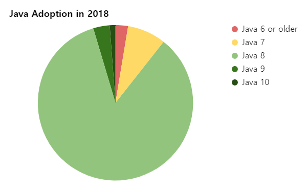

## java8 유료화?
> Q. 자바8 이상쓰면 유료라고 하던데요? 
<br/>
  > A. 아니예요. 공개된 버전은 무료입니다.(jdk-8u202 이 마지막 공개 버전입니다.)
<br/>
> Q. 그래요? 문제 생기면 책임지실꺼예요?
<br/>

* 그래서 이제 모두가 안심할수 있도록 `JDK8 이상은 openJDK`를 표준으로 제안합니다.
* oracleJDK 삭제하고 새로 설치해주면 됩니다.
* [https://adoptopenjdk.net/](https://adoptopenjdk.net/)
  - Choose a Version - OpenJDK 8 (LTS)
  - Choose a JVM - HotSpot
* 변경 후 문제없이 잘 쓰고 있습니다.
* 8이전 버전은 논외로 그대로 유지하시면 됩니다.
<br/>
* 참고자료 - [LINE의 OpenJDK 적용기: 호환성 확인부터 주의 사항까지](https://engineering.linecorp.com/ko/blog/line-open-jdk/)
<br/>
> 이 글을 쓰는 이유는 `패키지 표준을 8로` 올리고자 함입니다. why?
* 현재 대부분 java8 을 사용하고 있습니다.(85%)
<br/>

* 그래서 최근 책이나 StackOverFlow 등의 레퍼런스가 8이상 사용 가능한 문법들인 경우가 많습니다.
  - 다시 7버전 문법으로 변경하는 그 시간이 아깝습니다.
* 이제 람다표현식으로 코딩하고 싶습니다.
  - 코드 해석이 잘 안되요..흑
* Stream Example
```java
// Before 
List<Shape> list = new ArrayList<Shape>();
for (Shape s : shapes) {
	if (s.getColor() == RED) {
		list.add(s);
	}
}

// After
shapes.stream().filter(s -> s.getColor() == Red).collect(toList());
```
* 커밍쑨 `'git을 쓰면 뭐가 좋아요? svn도 아무 문제 없는데?'`
